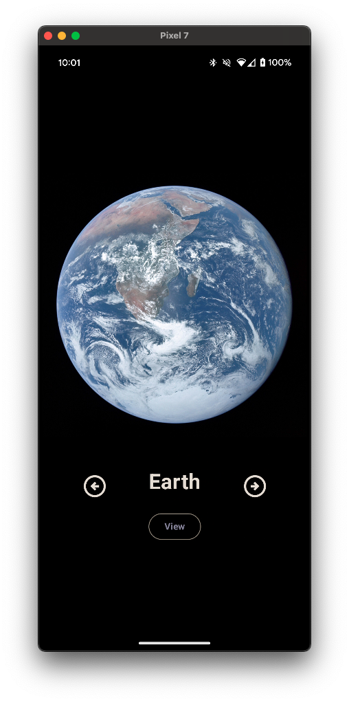
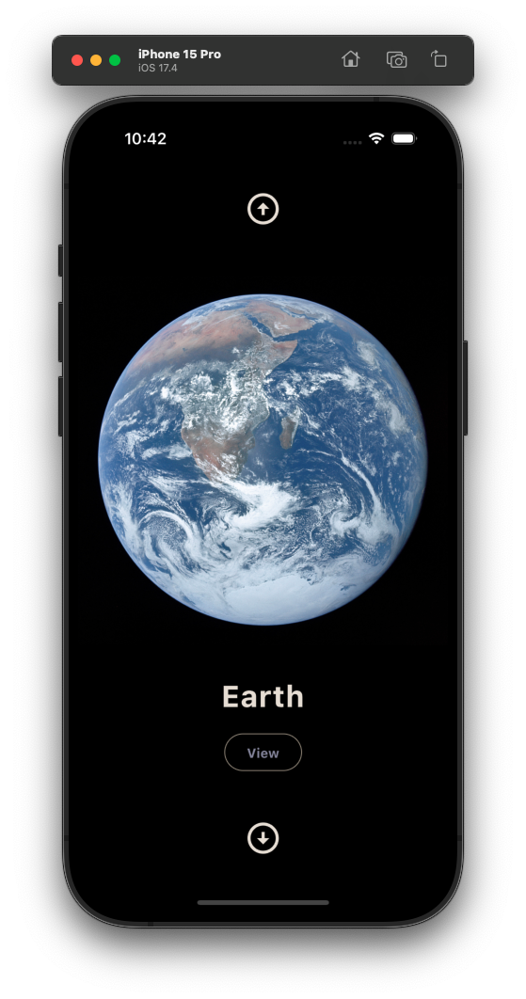
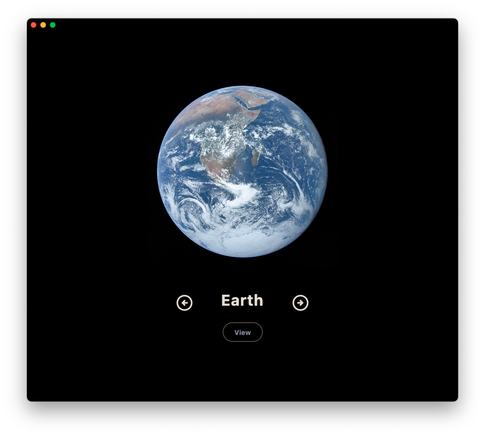
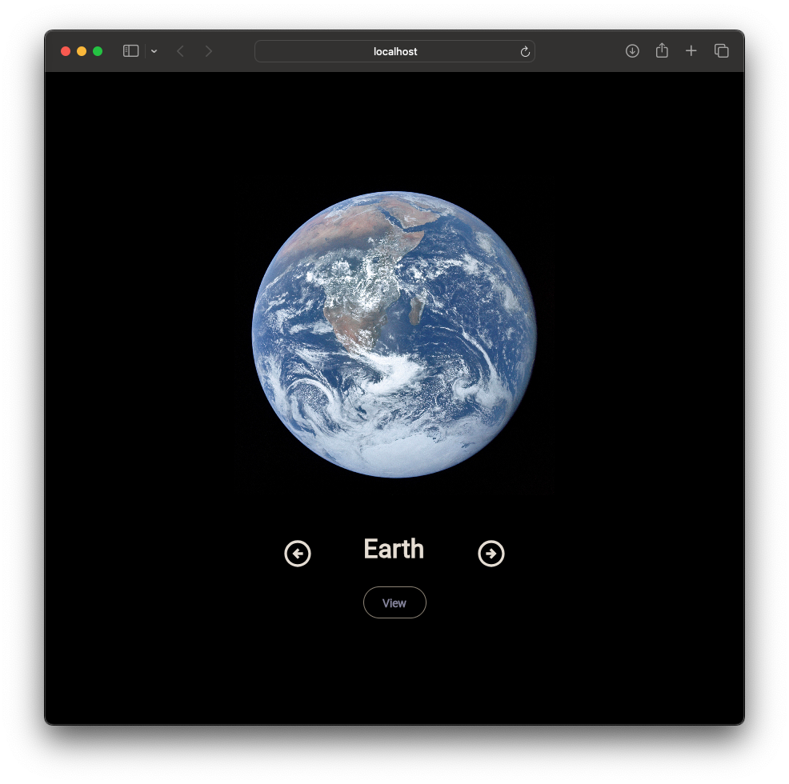

<H1>SolarSystemKMP</H1>

Explore the wonders of our solar system! Discover detailed information about each planet, from Mercury to Neptune

Supported Platforms
- Android
- IOS
- Web (Wasm)
- Desktop

Web App - Live [View](https://ismai117.github.io/SolarSystemKMP/)

##

<pre>
<h2 align="center">Android</h2>
</pre>

  
  

<pre>  
<h2 align="center">IOS</h2>
</pre>

  
  

<pre> 
<h2 align="center">Desktop</h2>
</pre>

  
  

<pre> 
<h2 align="center">Web</h2>
</pre>

  
  

