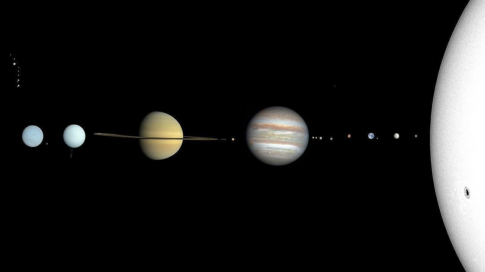
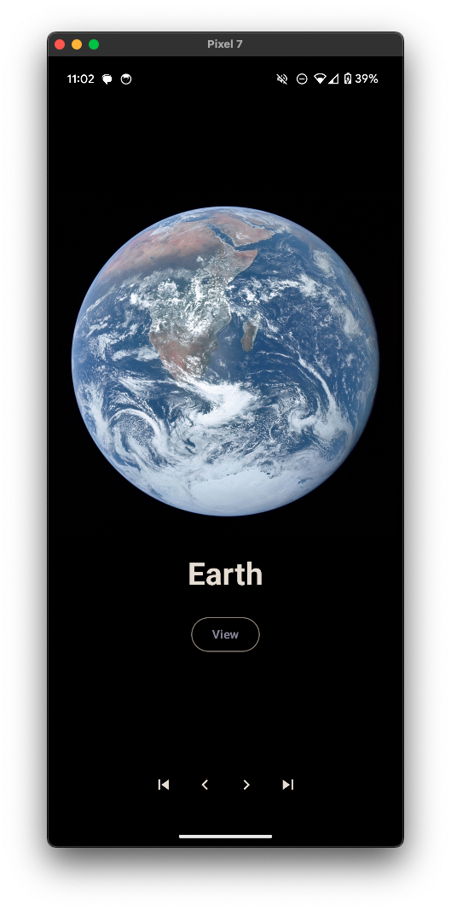
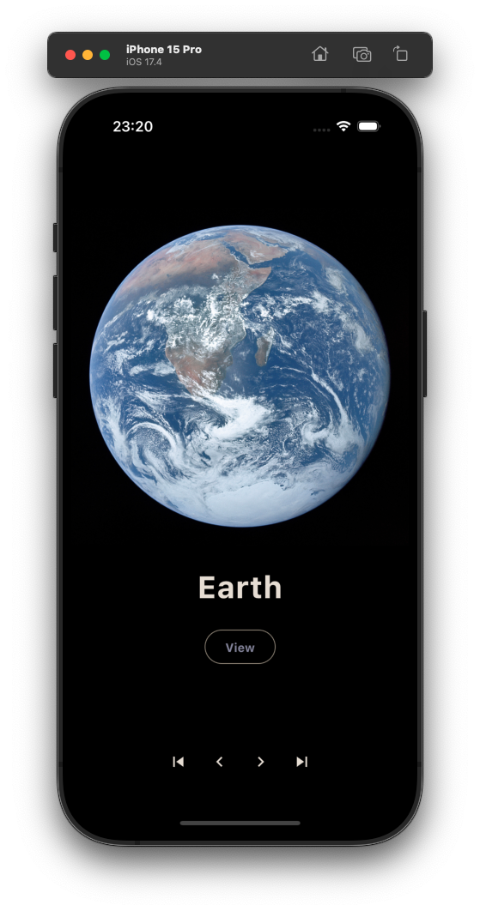
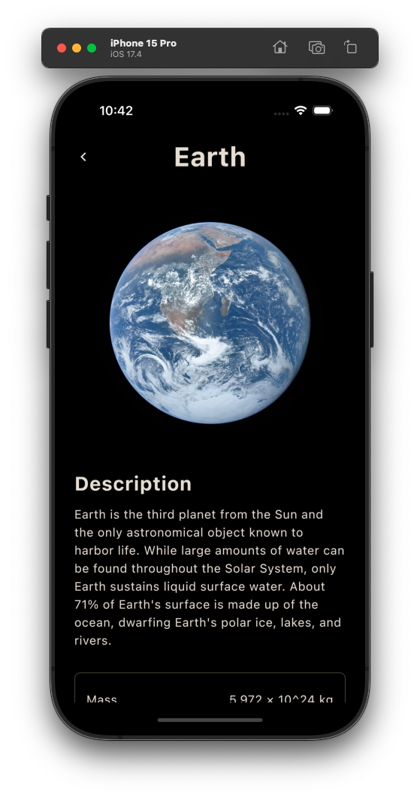
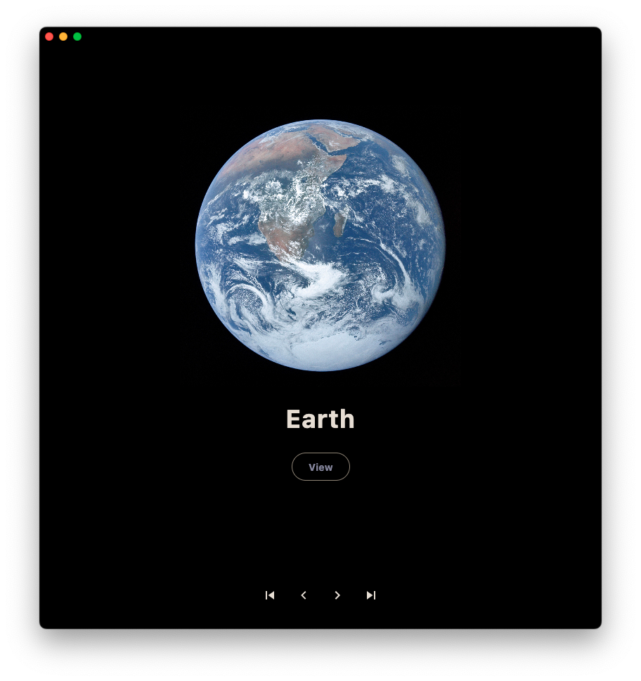
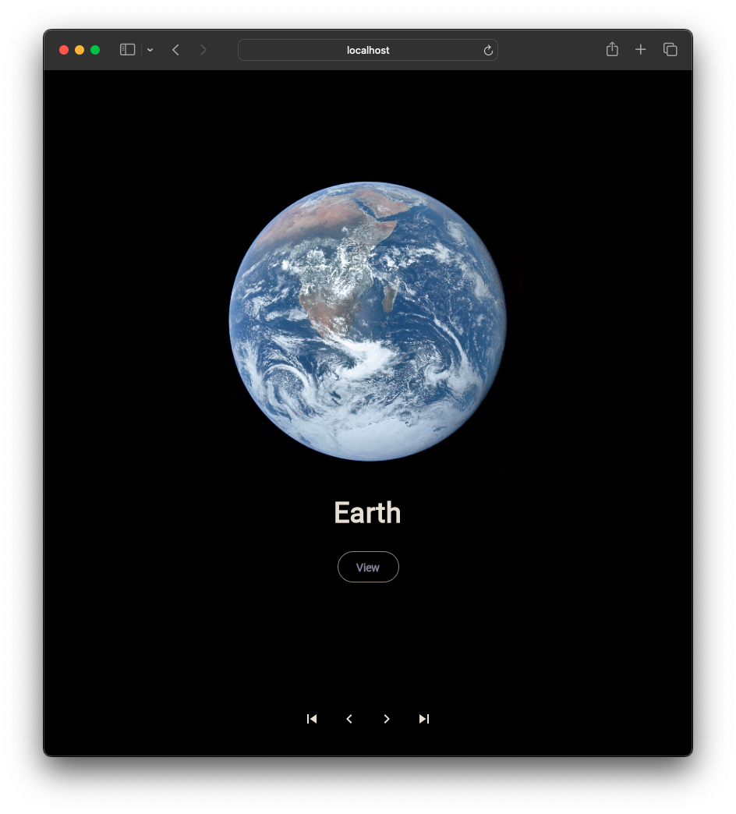
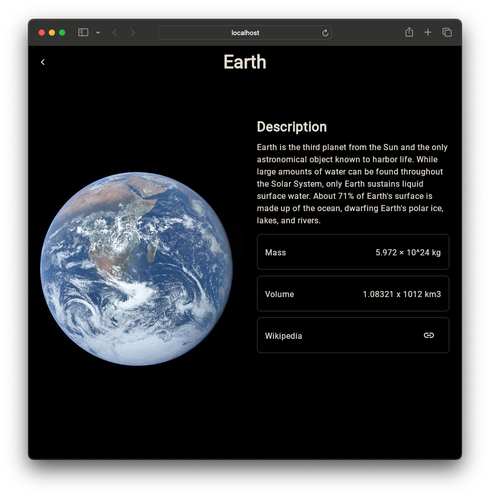
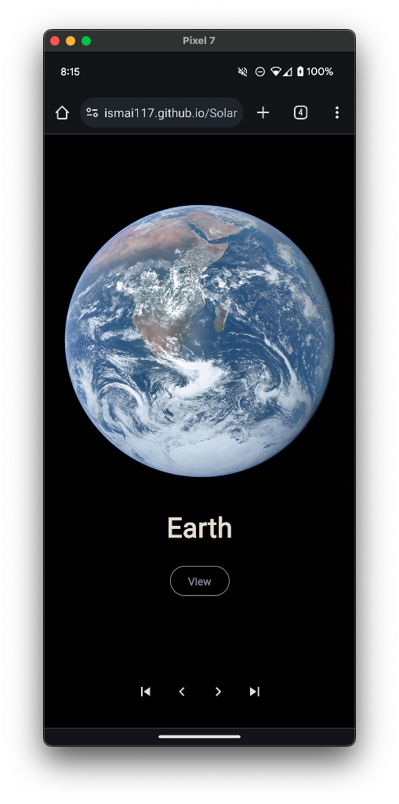
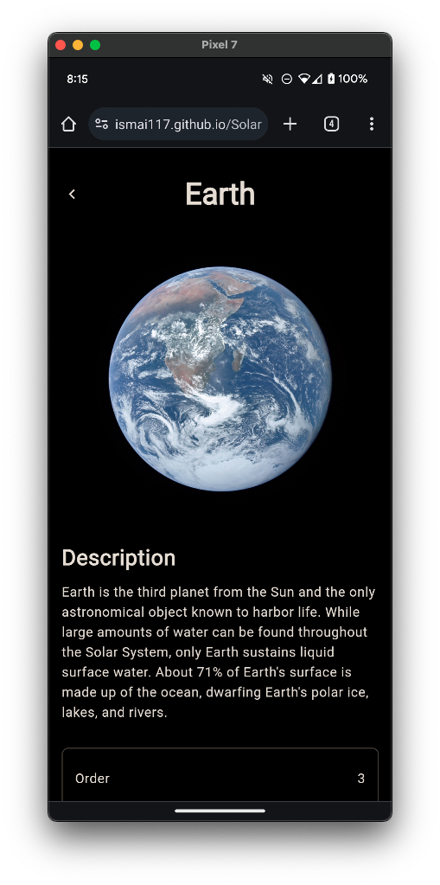

<H1>SolarSystemKMP</H1>

Explore the wonders of our solar system! Discover detailed information about each planet, from Mercury to Neptune

  

## Supported Platforms
- Android
- IOS
- Web (Js & Wasm)
- Desktop

Web App - Live [View](https://ismai117.github.io/SolarSystemKMP/) (Safari not working!)

## Stack
- 🍎 Shared UI - [Compose Multiplatform](https://github.com/JetBrains/compose-multiplatform)
- 🚏 Navigation - [Androidx](https://www.jetbrains.com/help/kotlin-multiplatform-dev/compose-navigation-routing.html#sample-project)
- 🏗 ViewModel - [Androidx](https://touchlab.co/kmp-viewmodel)
- 🌎 Network - [Ktor](https://github.com/ktorio/ktor)
- 📦 Storage - [KStore](https://github.com/xxfast/KStore)
- 💉 Dependecy Injection - [Koin](https://github.com/InsertKoinIO/koin)
- 🛢 Image Loading - [Coil](https://github.com/coil-kt/coil)
- 📋 Logging - [Napier](https://github.com/AAkira/Napier)

##

<pre>
<h2 align="center">Android</h2>
</pre>

  
  

<pre>  
<h2 align="center">IOS</h2>
</pre>

  
  

<pre> 
<h2 align="center">Desktop</h2>
</pre>

  
  

<pre> 
<h2 align="center">Web</h2>
</pre>

  
  

<pre>
<h2 align="center">Web Mobile</h2>
</pre>

  
  

